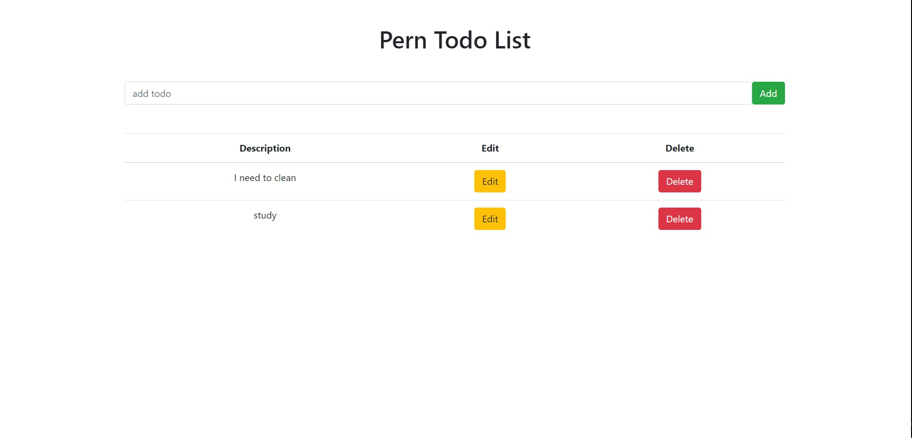

# PERNToDo

From freeCodeCamp PERN Stack Course - Postgres, Express, React, and Node instructing how to make a full-stack todo list with CRUD operations.

- \*[Instructional website](https://www.freecodecamp.org/news/learn-the-pern-stack-full-course/)

